<h1> Conduite Intelligente par Studio Ubisoft </h1> 
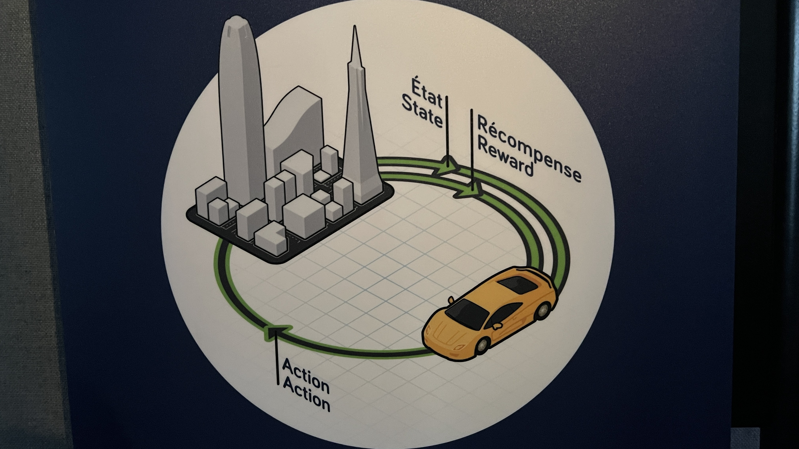

 

<h2> Centre des Sciences </h2>

Situé à 2 De la Commune St W, Montreal, Quebec H2Y 4B2. 
 
**(Oeuvre permanente intérieure)**

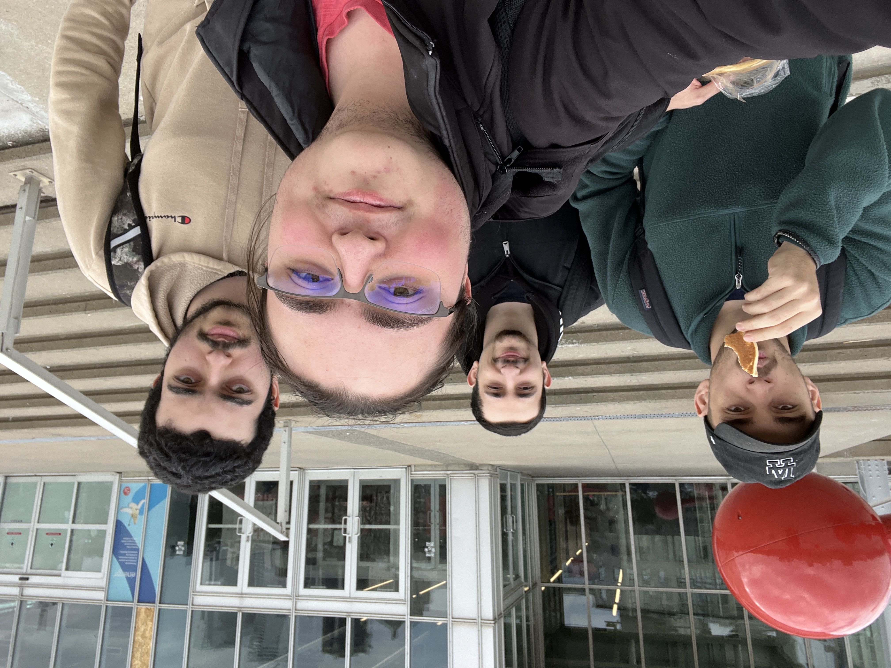
<h5>
  
J'ai visité l'exposition le 10 Avril 2024 </h5>

<h2> Studio Ubisoft </h2>

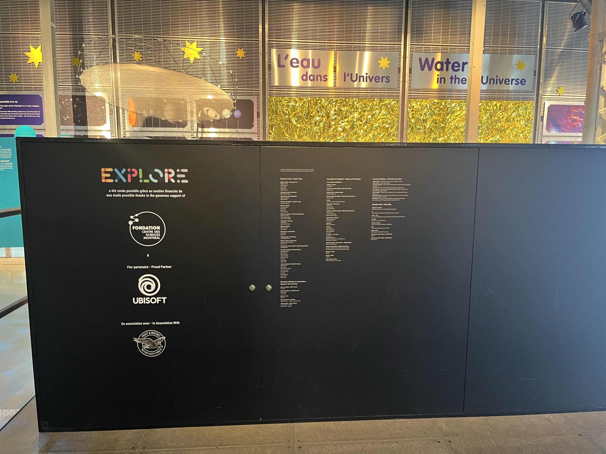

<h2>Description</h2>

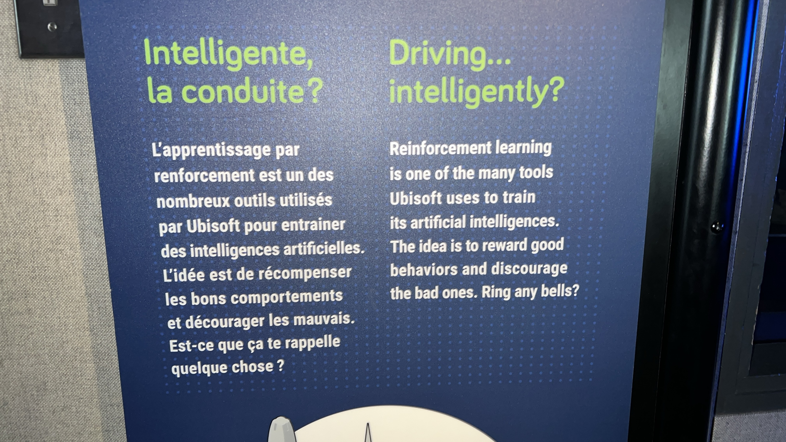

<h2>Crédits</h2>
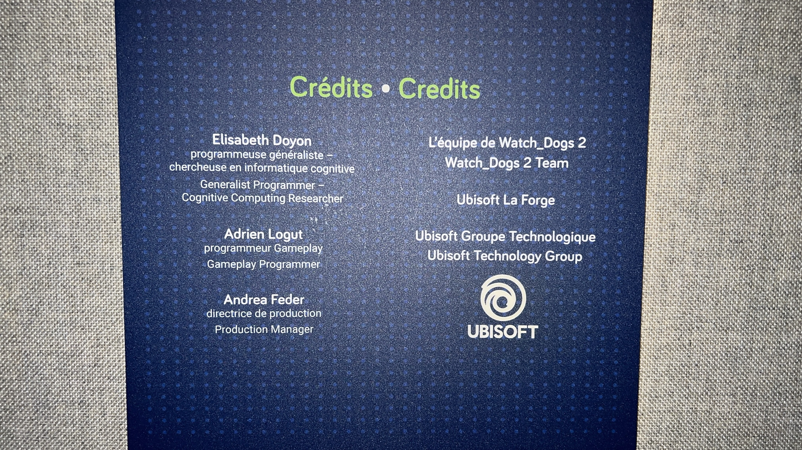

Cette équipe avait idée de créer un algorithme simple qui peut maitriser des actions binaires dans un jeu appeler "The Crew". 

> Ubisoft veut avant tout que son algorithme puisse répondre aux contraintes de l’industrie du jeu vidéo. Les chercheurs à l’origine de cet algorithme expliquent que :

> Les applications de l’apprentissage par renforcement dans les jeux vidéo ont connu des avancées massives au cours des dernières années. Les différentes communautés de chercheurs ont formé des agents pour être compétitifs avec les meilleurs joueurs du monde dans des jeux complexes. Chez Ubisoft, nous faisons le constat que ces systèmes ont été très peu utilisés dans l’industrie du jeu vidéo, et nous pensons que nous devons les démocratiser.

(Source: https://siecledigital.fr/2019/12/30/ubisoft-appris-voiture-conduire-seule-jeu-de-course/)

La durée peut dépendre. Si la voiture a un accident tôt, la simulation s'arrête, sinon elle continuera à conduire pendant une minute environ jusqu'à ce qu'un écran de fin apparaisse.

<h2>Installation intéractive </h2>

VIDEO HERE

<h2>Mise en espace</h2>

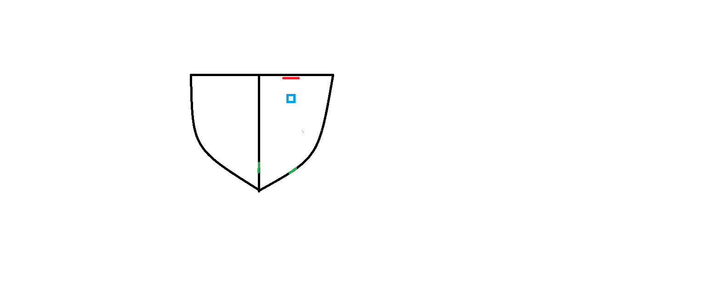
Vert: porte  
Bleu: Table d'écran intéractif  
Rouge: Écran  

<h2> Expérience </h2>

1. 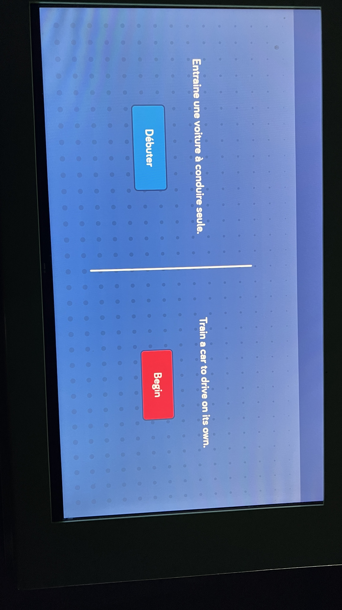 
   
   D'abord, vous choisissez votre langue.
   
2. 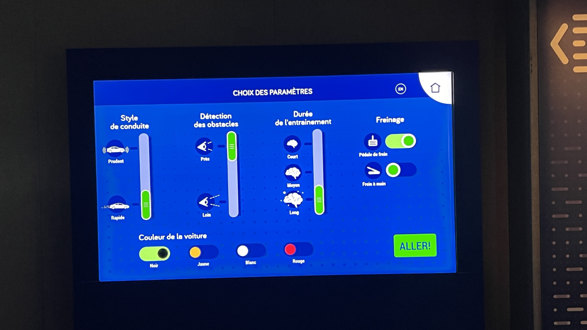 
   
   Ensuite, vous avez quelques options sélectionnées à ajuster telles que le style de conduite, la détection des obstacles, la durée de l'entraînement, le freinage et la couleur de la voiture que vous choisissez.
   
3. 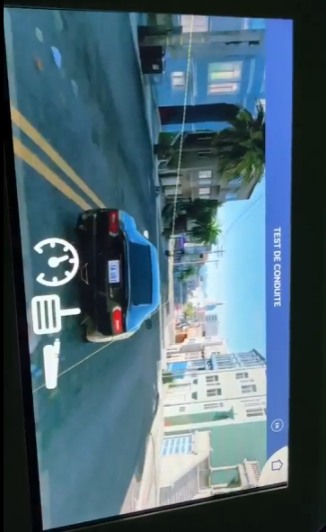 
   
   Ensuite, vous regardez l'écran pour voir le résultat de votre voiture qui se déplace autour.
   
4. 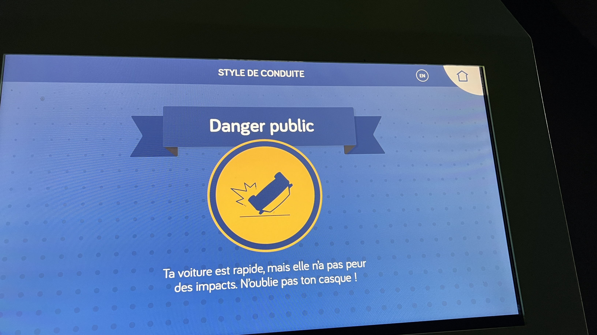 
   
   Et enfin, vous obtenez l'écran de résultat final qui vous indique votre performance avec la voiture autonome. Dans mon cas, je représente un danger pour le public.

 

<h2> Composante technique </h2>

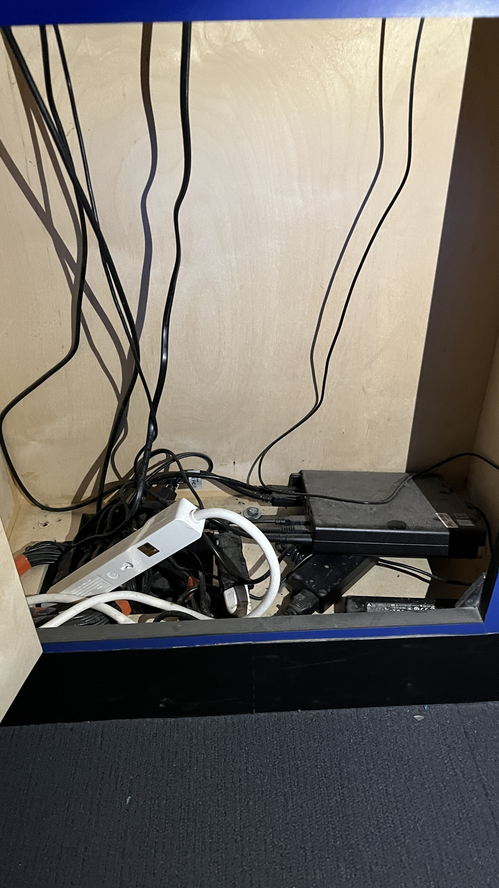

   - Explication de la composante 1.

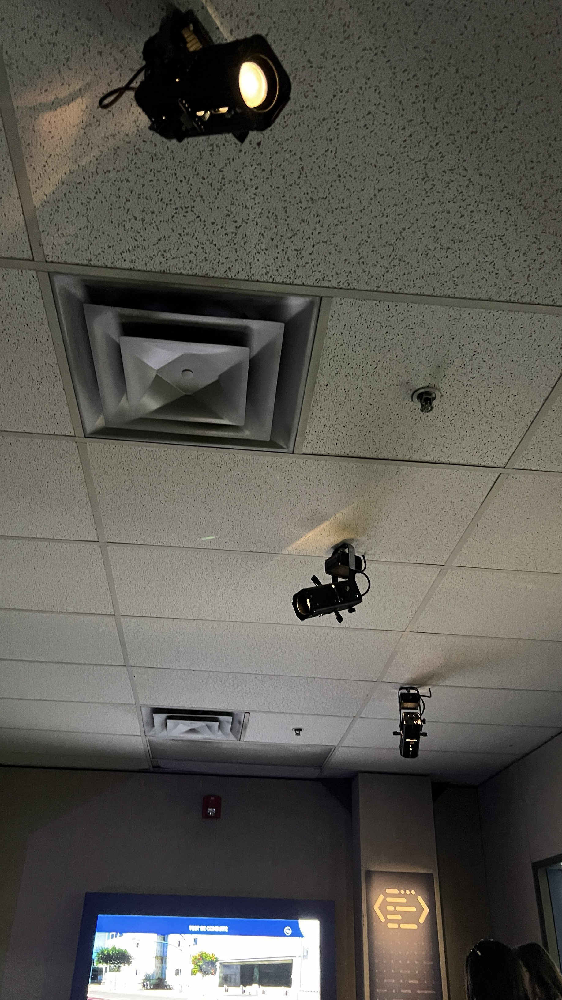

   - Explication de la composante 2.

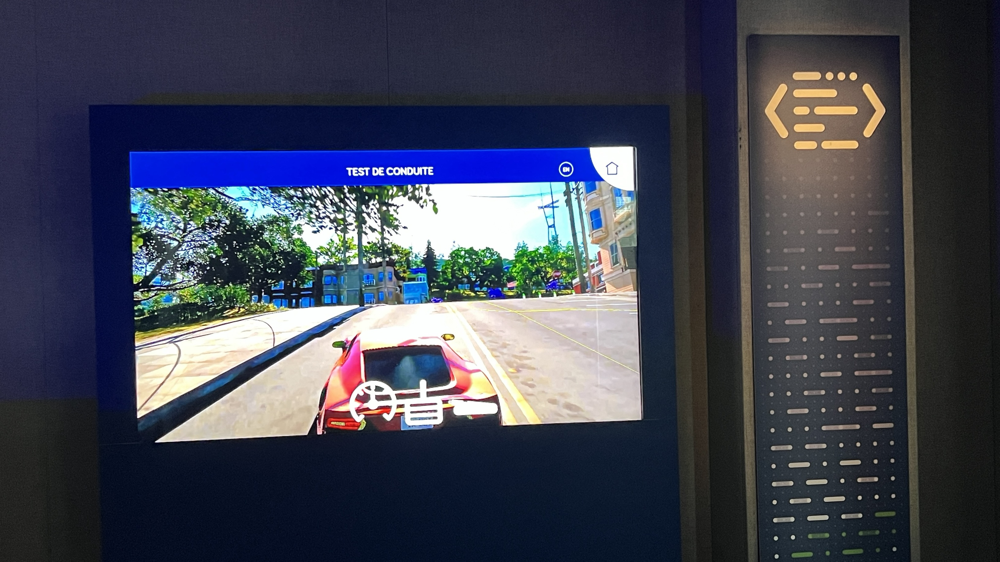

   - Explication de la composante 3.

<h2>Commentaire personnel </h2>
J'ai trouvé ce petit projet d'Ubisoft très intrigant et une expérience amusante. Si l'endroit n'avait pas été si rempli de monde, je serais resté et aurais continué à essayer d'obtenir un meilleur résultat, car c'était assez hilarant de voir comment la voiture conduisait de manière loufoque. C'était amusant d'être celui qui doit "démarrer" la voiture avec les bons réglages pour obtenir un bon résultat. Malheureusement, je n'ai pas pu m'améliorer en tant que conducteur, alors je risque d'être considéré comme un danger pour le public, À moins que je ne revienne et essaie à nouveau.

