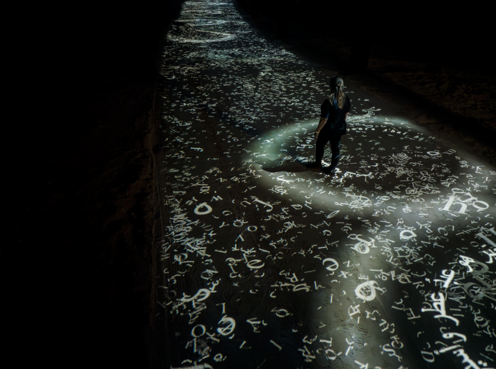

<h1>Conférence de Jade Séguela</h1> 

Nous avons assisté à une conférence donnée par Jade Séguela, la registraire du Studio Antimodular dirigé par Rafael Lozano-Hemmer. La conférence a abordé le processus complexe de transport des installations multimédias à travers différents pays, mettant en lumière les étapes essentielles de cette entreprise. Le Studio Antimodular, dirigé par l'artiste Rafael Lozano-Hemmer, est reconnu pour ses installations interactives visant à impliquer directement le public. 

<h2> Translation Stream, Abu Dhabi </h2>

La vision de Lozano-Hemmer met l'accent sur le rôle transformateur du public dans son art, où ses interactions avec les caméras, les capteurs et les microphones deviennent essentielles à l'œuvre elle-même. Soutenu par une équipe de 26 membres à temps plein de 10 pays différents, comprenant des architectes, des programmeurs, des artistes, des scientifiques, des écrivains, des designers et des musiciens, le Studio Antimodular repousse les limites depuis sa création en 2003. Jade Séguela, en tant que registraire, supervise la documentation et la logistique nécessaires pour transporter ces installations dans le monde entier. Elle a partagé des informations sur les défis rencontrés lors des expositions, comme celle d'Abu Dhabi, où les facteurs environnementaux ont posé des obstacles significatifs.

_(Source de l'image: [https://guivar.ch/Ecosystem-Alpha_v-2-0](https://www.lozano-hemmer.com/translation_stream.php))_ 

Malgré les conditions difficiles du désert, Séguela et son équipe ont réussi à naviguer à travers les complexités logistiques pour garantir la présentation en temps voulu de leur œuvre multimédia. En conclusion, la conférence de Jade Séguela a offert des perspectives précieuses sur le processus complexe de gestion et de transport des installations multimédias à l'échelle mondiale. Les informations partagées étaient pertinentes pour ceux qui envisagent une carrière dans ce domaine. 

La discussion franche des défis et des réalisations des projets du Studio Antimodular a été particulièrement instructive, nous donnant un aperçu des réalités des futurs projets dans ce domaine.

