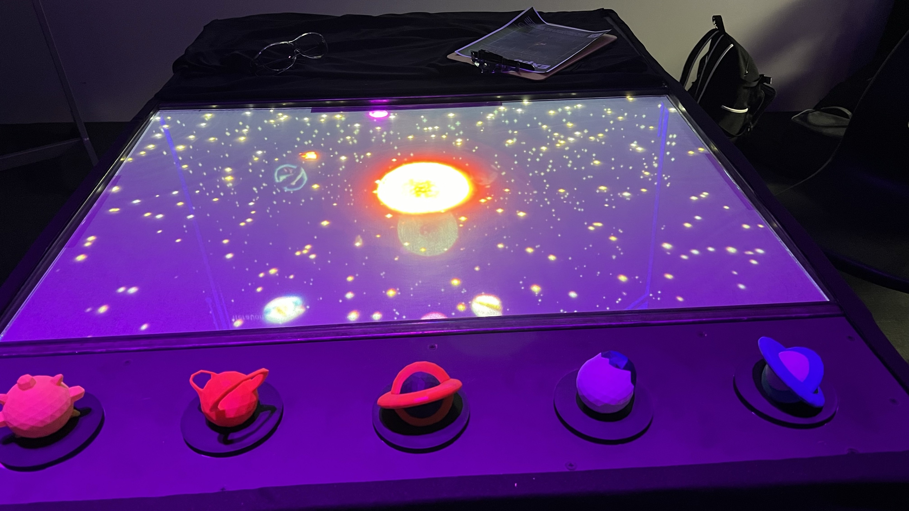
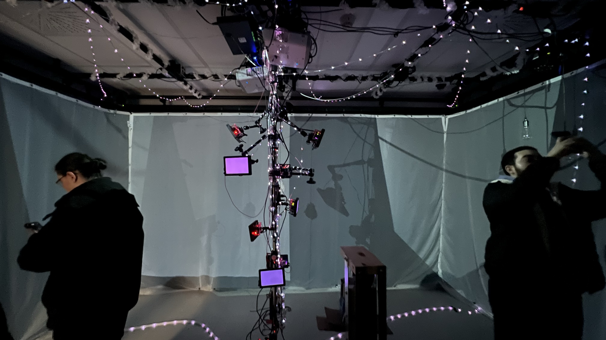

<h6> **Ordonner de 2 a 5 selon préférence personelle <h6>
<h1> #2: Sonalux </h1> 

*Source: https://tim-montmorency.com/2024/
<h2>Equipe</h2> Antoine Haddad  
Camélie Laprise  
Ghita Alaoui  
Vincent Desjardins
<h2>Installation</h2>

Les composants principalement présents comprenaient des haut-parleurs, des casques d'écoute, des câbles, des capteurs, un ordinateur et 3 projecteurs.

 

<h2>Schéma</h2>

<h2>Cours indispensables</h2>
Selon moi je pense que ces 3 cours sont importants pour réaliser ce projet: Installation multimedia, objets interactifs, traitement audiovisuel 
<h2>Expérience</h2>

J'ai trouvé l'expérience plutôt agréable. Tout d'abord, il faut se placer devant le poteau pour que les capteurs vous détectent et affichent le message "Chaque geste compte", signifiant que vos gestes ont de l'importance. J'ai pris plaisir à jouer avec les indices sonores et à voir les barres s'allumer, interagissant avec le volume de la musique, que je réglais plus haut ou plus bas.

<h1> #3: Canevas cosmique </h1>

*Source: https://tim-montmorency.com/2024/
<h2>Equipe</h2> Jacob Alarie-Brousseau  
Étienne Charron  
Jérémy Cholette  
Quoc Huy Do  
Mikael Tourangeau
<h2>Installation + Schéma</h2>
Les principaux composants comprenaient des haut-parleurs, un commutateur, des câbles, un ordinateur et des projecteurs.

<h2>Cours indispensables</h2>
Selon moi je pense que ces 3 cours sont importants pour réaliser ce projet: Interactivité ludique, Installation multimédia, Animation 2D
<h2>Expérience</h2>
J'ai trouvé l'expérience cosmique géniale dans l'ensemble. L'idée était cool, mais j'aurais aimé explorer davantage l'interaction entre les planètes et le soleil. Je me souviens qu'elle a planté lorsque nous avons tout mis au centre, alors que je m'attendais à voir un trou noir apparaître.

<h1> #4: Effet Papillon </h1>

*Source: https://tim-montmorency.com/2024/
<h2>Equipe</h2> Raphael Dumont  
Alexis Bolduc  
William Morel  
Alexia (Ryan) Papanikolaou  
Viktor Zhuravlev  
Jasmine Lapierre
<h2>Installation + Schéma</h2>

<h2>Cours indispensables</h2>
Selon moi je pense que ces 3 cours sont importants pour réaliser ce projet: Objets interactifs, Installation multimédia, Conception d’une expérience multimédia
<h2>Expérience</h2>
Même si cela a été classé en quatrième position, cela ne signifie pas que je n'apprécie pas tout le travail et la créativité investis dans ce projet. Malheureusement, je n'ai pas eu le temps de voir la configuration finale de tout, mais d'après ce que j'ai vu et avec quoi j'ai interagi, c'est un concept vraiment magnifique.

 

Je ne peux pas imaginer tout le travail que tous les étudiants ont mis dans ce projet. J'ai entendu des histoires sur les tracas qu'ils ont rencontrés car ils devaient constamment enlever tout l'équipement et le réinstaller un grand nombre de fois, car ils devaient laisser le petit studio disponible pour d'autres classes.

<h1> #5: Rhizomatique</h1>

*Source: https://tim-montmorency.com/2024/
<h2>Equipe</h2> Julyanne Desjardins  
Maika Désu  
Laurie Houde  
Felix Testa Radovanovic
<h2>Installation + Schéma</h2>

<h2>Cours indispensables</h2>
Selon moi je pense que ces 3 cours sont importants pour réaliser ce projet:
<h2>Expérience</h2>

<h6> *Toutes les images de schémas proviennent de https://tim-montmorency.com/2024/ </>

