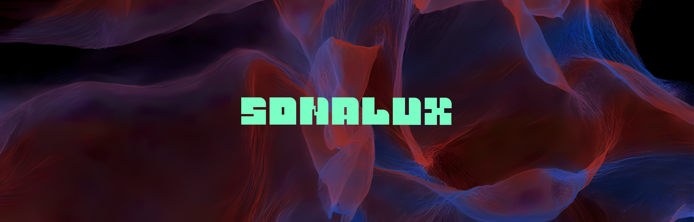
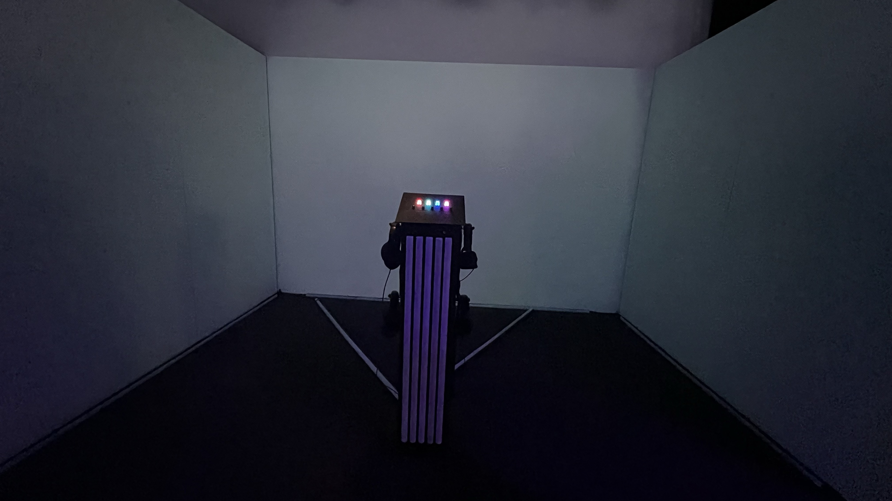
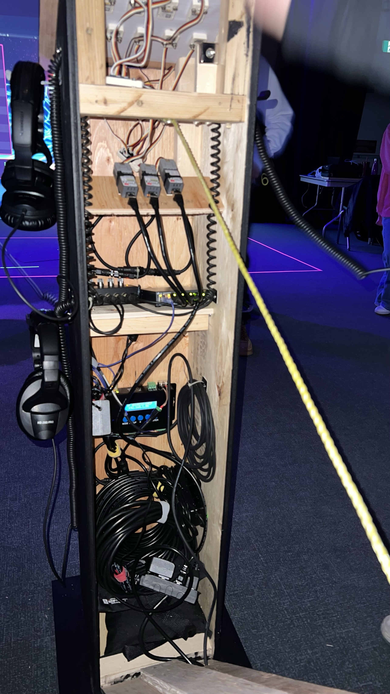
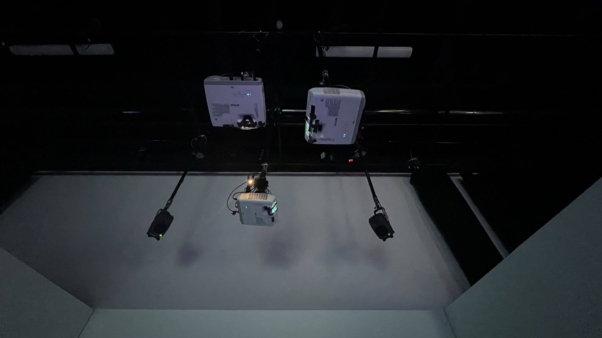
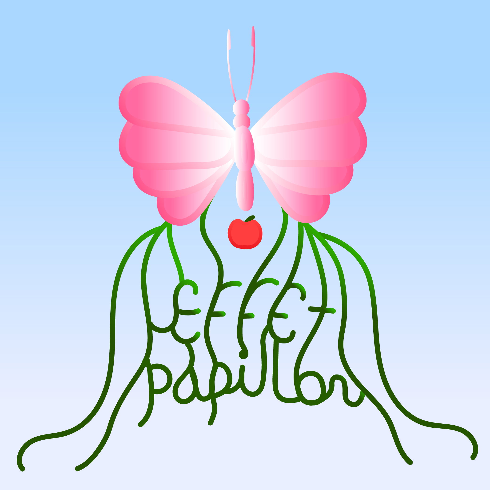

<h6> **Ordonner de 2 a 5 selon préférence personelle <h6>
<h1> #2: Sonalux </h1> 

Source: https://tim-montmorency.com/2024/
<h2>Equipe</h2> Antoine Haddad  
Camélie Laprise  
Ghita Alaoui  
Vincent Desjardins
<h2>Installation + Schéma</h2>

 
 
 
 
 
<h2>Cours indispensables</h2>
<h2>Expérience</h2>

<h1> #3: Canevas cosmique </h1>

Source: https://tim-montmorency.com/2024/
<h2>Equipe</h2> Jacob Alarie-Brousseau  
Étienne Charron  
Jérémy Cholette  
Quoc Huy Do  
Mikael Tourangeau
<h2>Installation + Schéma</h2>
<h2>Cours indispensables</h2>
<h2>Expérience</h2>

<h1> #4: Effet Papillon </h1>

Source: https://tim-montmorency.com/2024/
<h2>Equipe</h2> Raphael Dumont  
Alexis Bolduc  
William Morel  
Alexia (Ryan) Papanikolaou  
Viktor Zhuravlev  
Jasmine Lapierre
<h2>Installation + Schéma</h2>
<h2>Cours indispensables</h2>
<h2>Expérience</h2>

<h1> #5: Rhizomatique</h1>

Source: https://tim-montmorency.com/2024/
<h2>Equipe</h2> Julyanne Desjardins  
Maika Désu  
Laurie Houde  
Felix Testa Radovanovic
<h2>Installation + Schéma</h2>
<h2>Cours indispensables</h2>
<h2>Expérience</h2>

