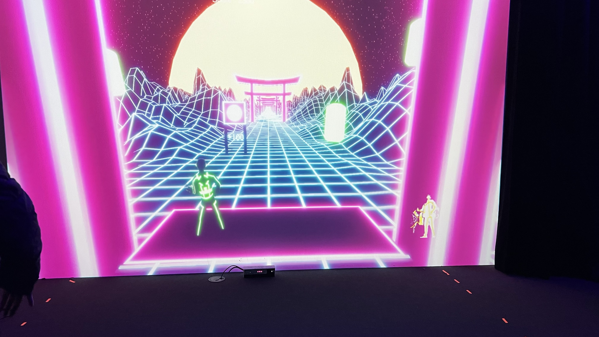
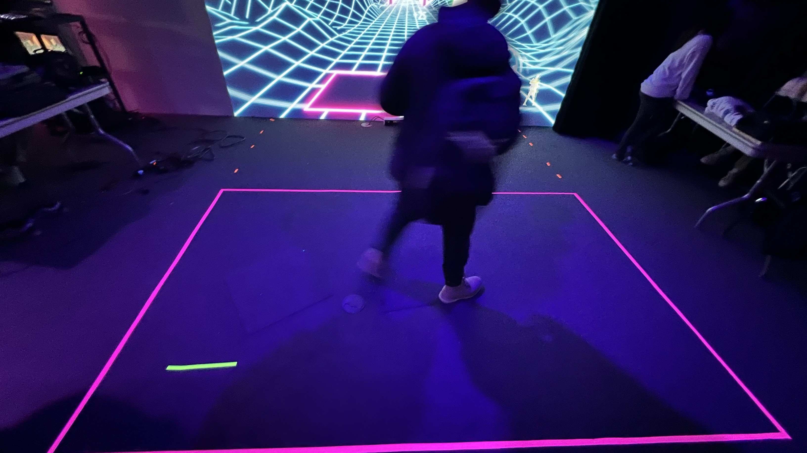
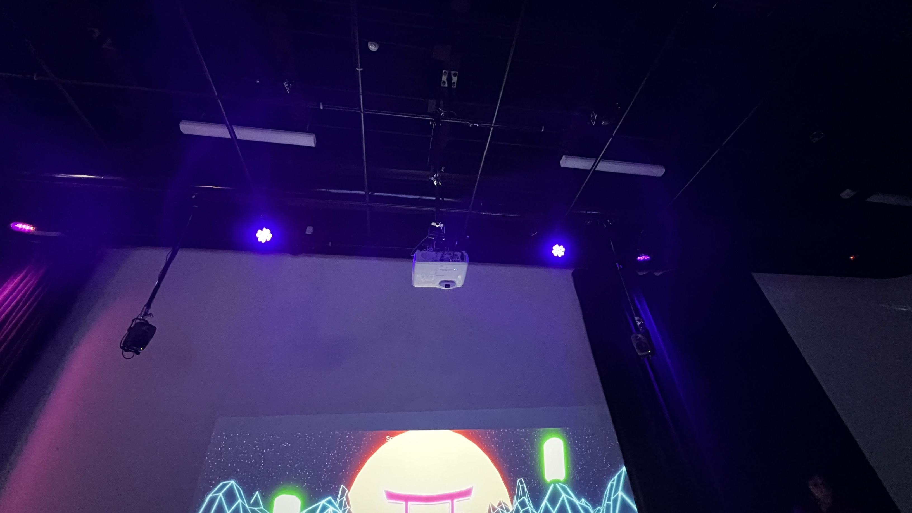
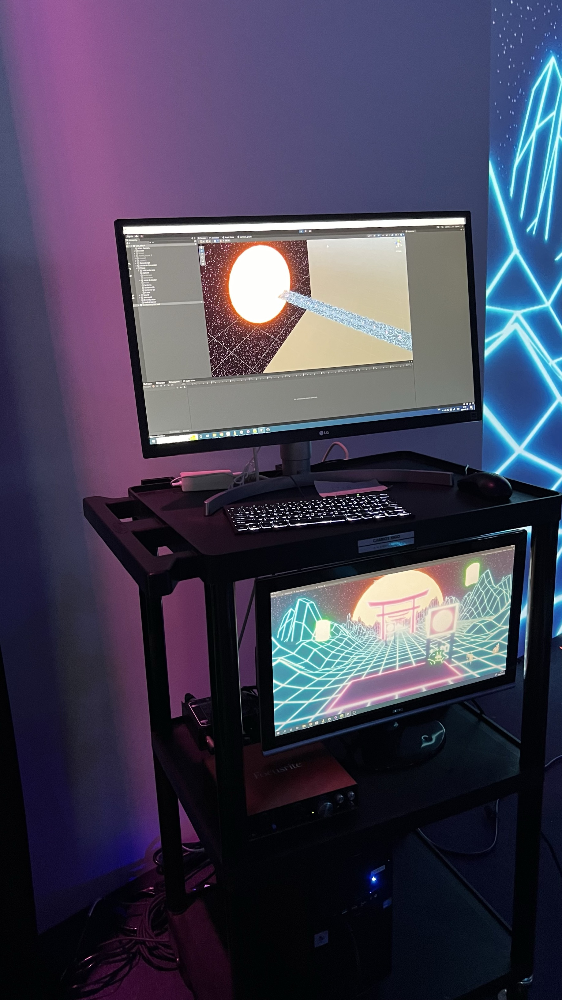
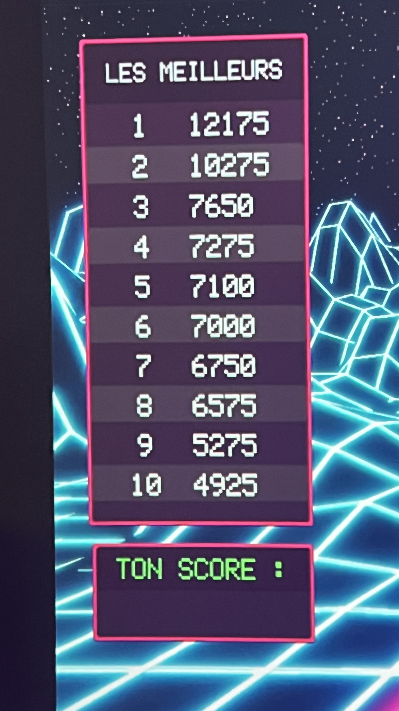
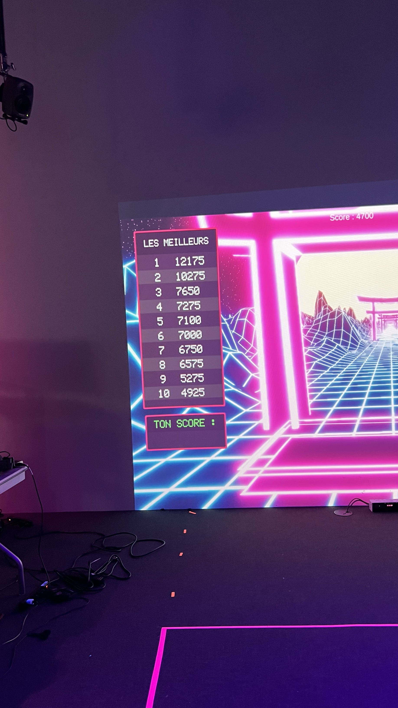
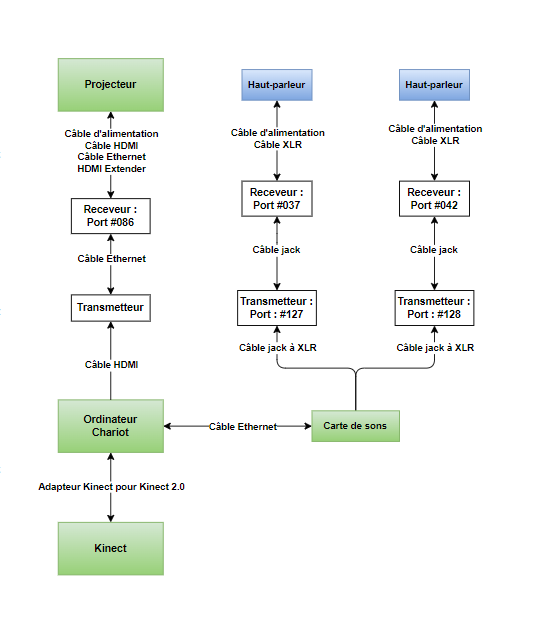
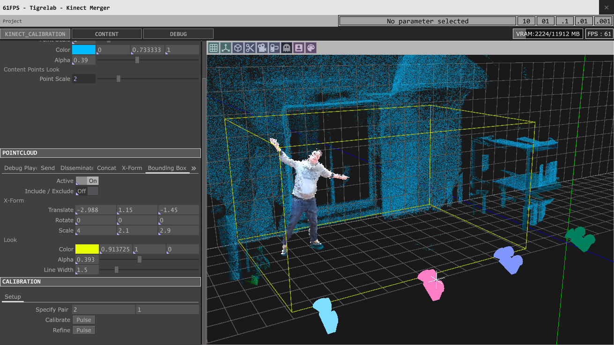

<h1> KIGO </h1> 

Source: https://tim-montmorency.com/2024/projets/Kigo/docs/web/index.html

<h2> Grand studio, Collège Montmorency </h2>

_**Oeuvre temporaire intérieure**_

 
 <b> J'ai visité l'exposition le 13 Mars 2024 <b>

<h2>Équipe </h1>

Érick Ouellette 
William Rathier Mailly 
Gabriel Clerval 
Nicolas St-Martin 
Antoine Dion

<h1>Description</h1>

> Kigo est un projet multimédia interactif où l’interacteur doit esquiver des obstacles virtuels qui se rapproche vers lui dans une thématique des quatre saisons de l’année. L’interacteur doit embarquer se déplacer dans une zone de jeu où une Kinect captera ses mouvements. L’avatar du jeu suivra les mouvements de l’interacteur. Les mouvements possibles sont d’aller de gauche à droite et l’accroupissement. L’esthétique du projet sera une projection d’un univers 3d de style néon rétro, qui ressemblera à une route où les obstacles s’avancent vers le joueur. Il y aura des arbres des deux côtés de la route et ceux-ci vont changer à chaque niveau puisque ces niveaux sont basés chacun sur une saison différente. Une musique synthwave jouera pour chaque niveau et sera accompagnée d’ambiances et des bruitages semblables à leur saisons. Le temps de cette expérience est démontré par le fait que chaque niveau se passe dans une différente saison, ce qui fait passer une année. Cette expérience a pour but d’amener de faire ressentir à l’interacteur, de l’engagement et de la détermination pour finir ces niveaux qui deviennent de plus en plus difficiles.
(Source: https://tim-montmorency.com/2024/projets/Kigo/docs/web/preproduction.html)

La durée peut dépendre du joueur et le jeu se terminera une fois que toutes les vies auront été perdues.

<h2>Installation intéractive </h2>

Kigo est une exposition interactive car vous faites partie de l'œuvre, vous vous déplacez et elle détecte vos mouvements. Cela est un jeu.

<h2>Mise en espace</h2>

<h2>Élements nécessaires à la mise en exposition + composantes et techniques</h2>

Les éléments principalement présents étaient des haut-parleurs, une Kinect, des câbles, un ordinateur et des projecteurs.

- Kinect pour l'intéraction

- Zone dédiée

- Projecteur et sons (L + R)

  

Logiciel Unity
 

<h3>Autres logiciels requis</h3>

- Kinect studio
- Touch designer (Si Unity ne marche pas)
- Blender ou Maya
- OBS Studio
- Reaper

 

- **Audio**
  - 1 Console de sons
  - 1 Carte de sons
  - 2 Haut-parleurs Genelec 8010APM
  - 4 Câbles XLR (M->F) (Longueur minimale estimée entre 4-6 mètres)

- **Vidéo**
  - 1 Projecteur
  - 1 Kinect V2
  - 1 Système d'accrochage pour le projecteur

- **Électricité**
  - 2 Cordon IEC (pour alimenter les haut-parleurs)
  - 2 Multiprise
  - 2 Extensions de fils électrique (Longueur minimale estimée entre 6-8 mètres)
  - 1 Câble d’alimentation pour ordinateur
  - 1 Câble d’alimentation pour console de son

- **Réseau**
  - 2 Fils Ethernet (longueur minimale estimée entre 4-8 mètres)
  - 1 HDMI Extender
  - 2 Câbles HDMI
  - 1 Câble displayPort

- **Ordinateur**
  - 1 Chariot Ordinateur

- **Autres**
  - Tapis de protection
  - 3 Safety en métal
  - 1 Powercon
  - 1 Magic Arm

Source de l'équipement, logiciels et l'image composante: https://github.com/espace-interactif/Kigo/tree/main/docs/preproduction

<h2>Composantes ou technologies que je ne connais pas</h2>

<h4>Touch designer est une application que je n'ai pas entendu parlé, je connais en général Unity, mais je voulais de savoir en plus ce que Touch designer est pour que sa soit une alternative pour Unity.  </h4>

(Source de l'image: https://fisheyeimmersive.com/article/tout-comprendre-a-touchdesigner-ce-logiciel-qui-permet-de-creer-en-temps-reel/)

  
C'est un logiciel super cool qui te permet de créer des trucs vraiment géniaux en temps réel. Tu peux faire des trucs comme des installations artistiques, des spectacles interactifs, des animations visuelles, et plein d'autres trucs créatifs.
  
Ce qui est cool avec TouchDesigner, c'est que tu construis tout visuellement en reliant des blocs ensemble. Ces blocs peuvent être des trucs comme des vidéos, des animations, des effets visuels, des données de capteurs, ou même des contrôles interactifs comme des boutons ou des mouvements de la main.
  
Et si tu veux aller plus loin, tu peux même programmer des trucs en Python pour rendre tes créations encore plus puissantes et personnalisées. C'est vraiment un outil versatile et fun pour les artistes et les créatifs qui veulent donner vie à leurs idées de manière vraiment impressionnante.
  

<h2>Commentaire personnel </h2>

Kigo était mon préféré car j'adore l'idée d'une exposition qui est un jeu, où vous devez constamment interagir avec elle (vous déplacer, esquiver les obstacles et collecter des points tout en essayant de garder tous vos cœurs pour ne pas perdre). C'est un concept magnifique pour moi. Si j'avais une idée pour créer une exposition, je penserais également à en faire une sorte de jeu afin que les utilisateurs puissent s'amuser et l'expérimenter de première main.

