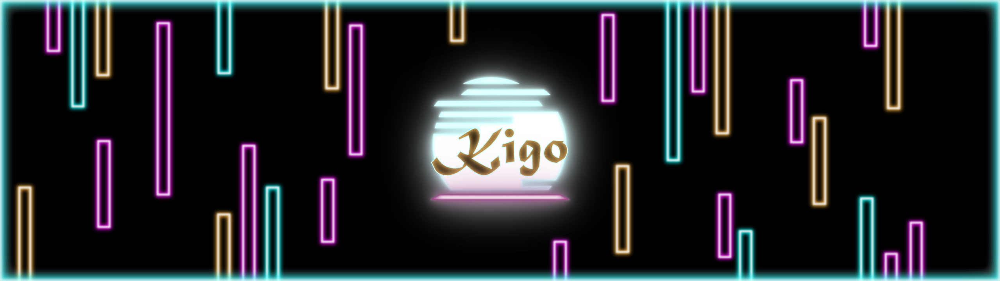

<h1> KIGO </h1> 

<h2> Grand studio, Collège Montmorency </h2>

**Oeuvre temporaire intérieure**
<b> J'ai visité l'exposition le 13 Mars 2024 <b>

<h2>Équipe </h1>

Érick Ouellette 
William Rathier Mailly 
Gabriel Clerval 
Nicolas St-Martin 
Antoine Dion

<h1>Description</h1>

> Kigo est un projet multimédia interactif où l’interacteur doit esquiver des obstacles virtuels qui se rapproche vers lui dans une thématique des quatre saisons de l’année. L’interacteur doit embarquer se déplacer dans une zone de jeu où une Kinect captera ses mouvements. L’avatar du jeu suivra les mouvements de l’interacteur. Les mouvements possibles sont d’aller de gauche à droite et l’accroupissement. L’esthétique du projet sera une projection d’un univers 3d de style néon rétro, qui ressemblera à une route où les obstacles s’avancent vers le joueur. Il y aura des arbres des deux côtés de la route et ceux-ci vont changer à chaque niveau puisque ces niveaux sont basés chacun sur une saison différente. Une musique synthwave jouera pour chaque niveau et sera accompagnée d’ambiances et des bruitages semblables à leur saisons. Le temps de cette expérience est démontré par le fait que chaque niveau se passe dans une différente saison, ce qui fait passer une année. Cette expérience a pour but d’amener de faire ressentir à l’interacteur, de l’engagement et de la détermination pour finir ces niveaux qui deviennent de plus en plus difficiles.
(Source: https://tim-montmorency.com/2024/projets/Kigo/docs/web/preproduction.html)

La durée peut dépendre du joueur et le jeu se terminera une fois que toutes les vies auront été perdues.

<h2>Installation intéractive </h2>

Kigo est une exposition interactive car vous faites partie de l'œuvre, vous vous déplacez et elle détecte vos mouvements. Cela est un jeu.

<h2>Mise en espace</h2>

<h2>Élements nécessaires à la mise en exposition + composantes et techniques</h2>

<h2>Expérience vécue + Commentaire personnel </h2>

