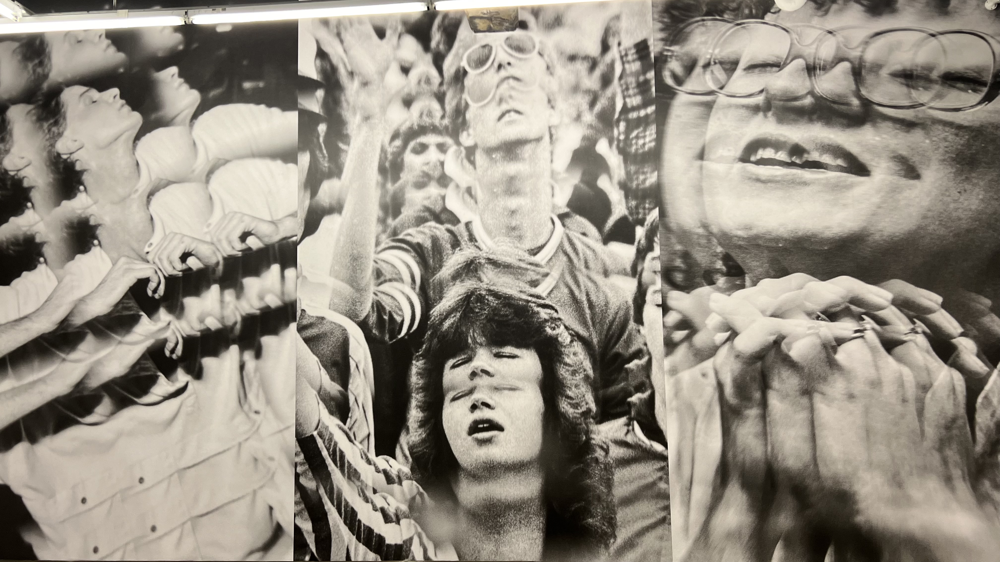
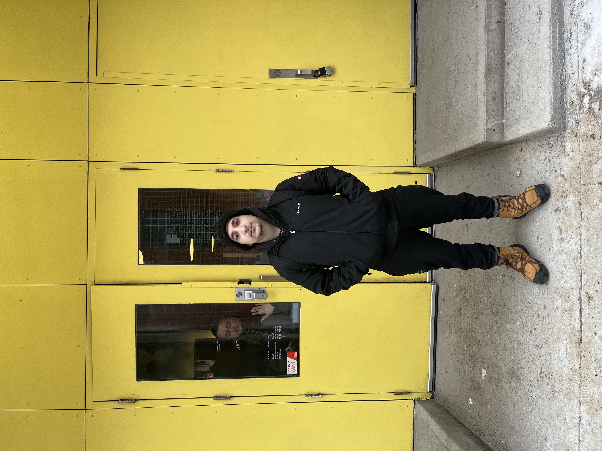
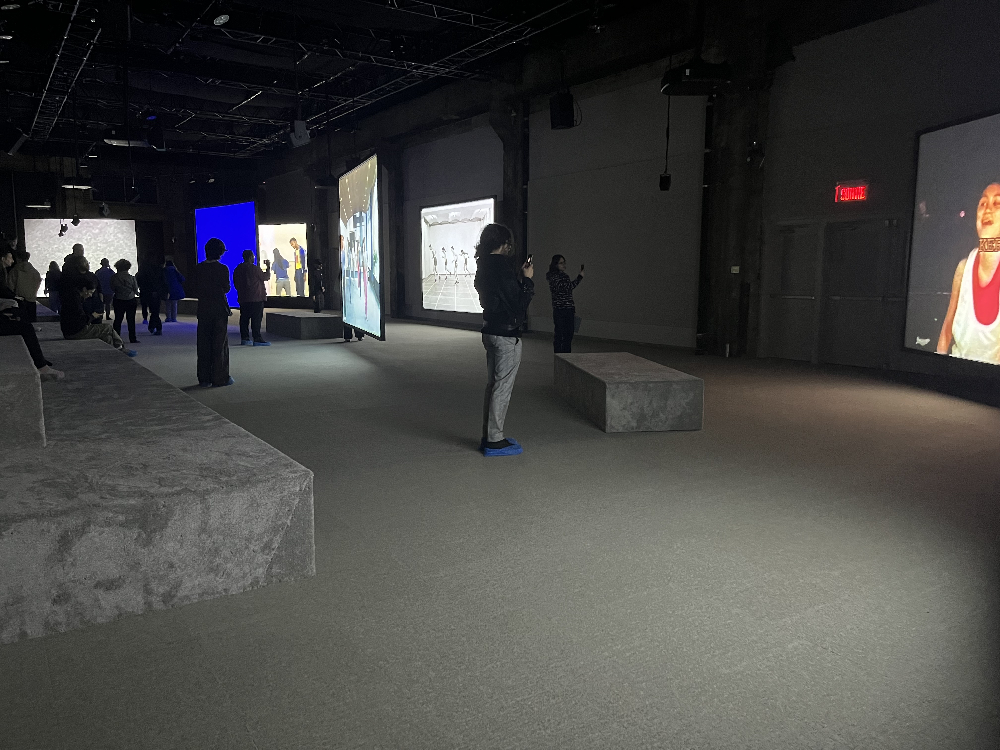
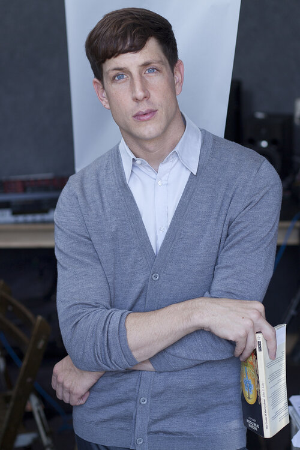
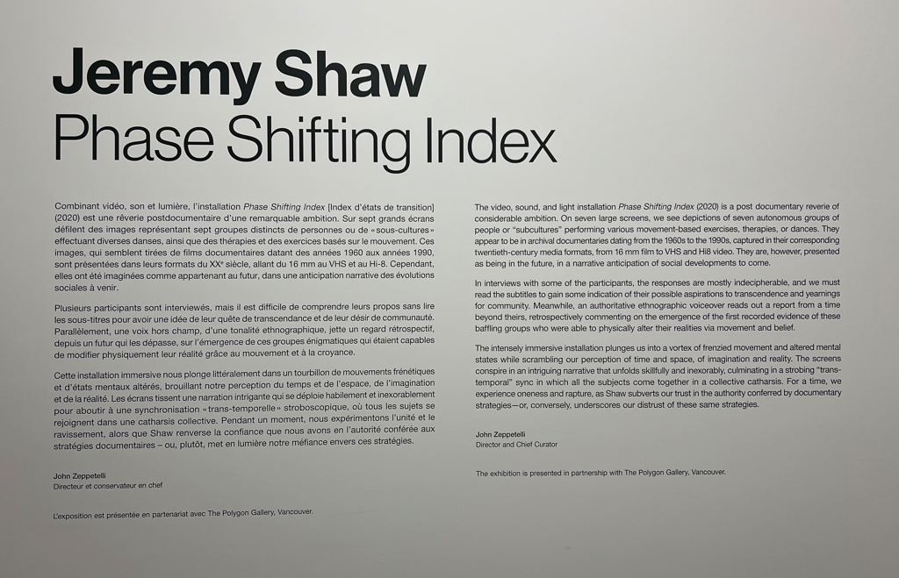
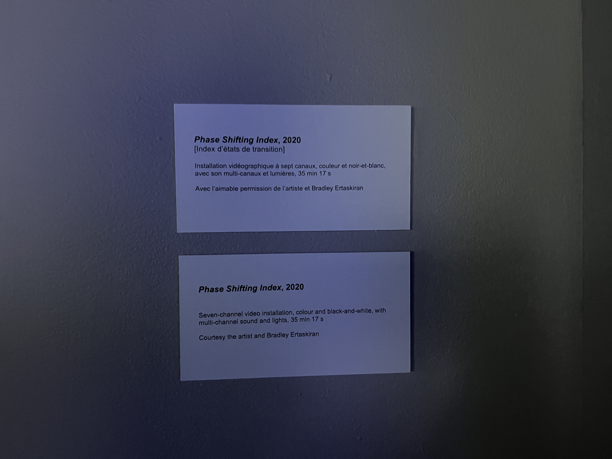
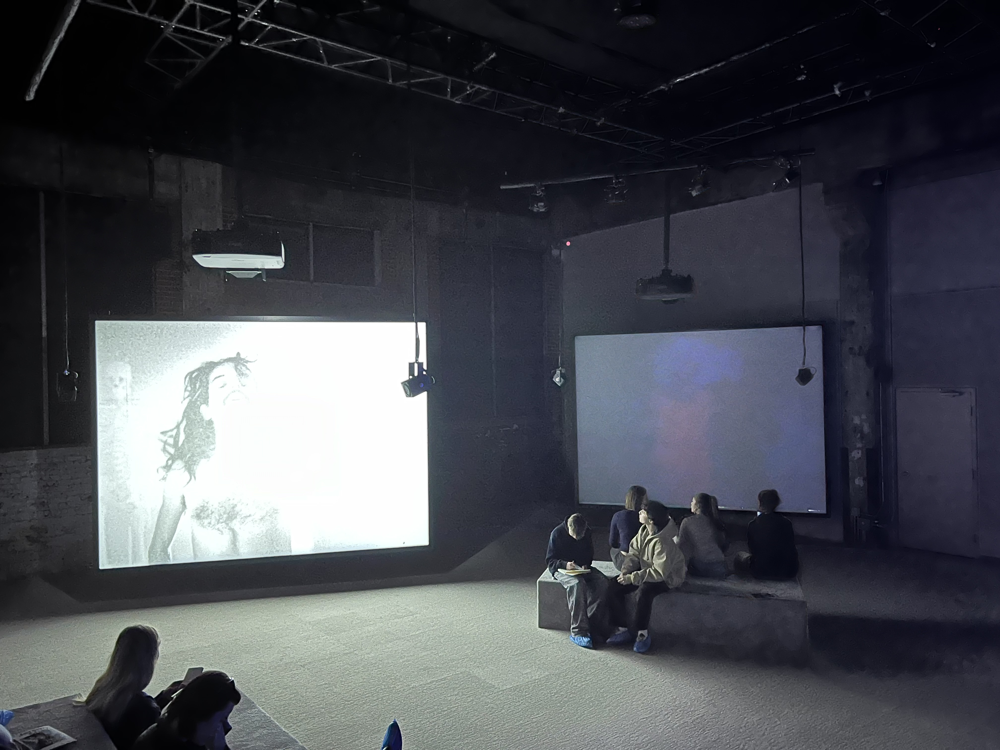
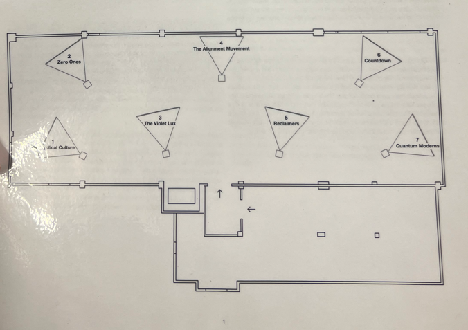

<h1> Exposition par Jeremy Shaw: Phase Shifting Index </h1> 

 

<h2> Fonderie Darling </h2>

Situé à 745 Rue Ottawa, Montréal, Quebec du 12 décembre 2023 jusqu'au 25 février 2024. **(Oeuvre itinérante)**

  <h4> _J'ai visité l'exposition le 31 Janvier 2024_ </h4>  

<h2> "Phase Shifting Index" </h1>

<h2> Jeremy Shaw </h2>
Créer au Centre Pompidou à Paris, France 2020

<h6> (Source de l'image: https://www.stilinberlin.de/blog/2010/11/interview-jeremy-shaw.html) </h6>

<h2>Description</h3>
<h5> Source: https://fonderiedarling.org/Phase-Shifting-Index </h5>

<h2>Installation Immersive </h2>

<h2>Mise en espace</h2>

