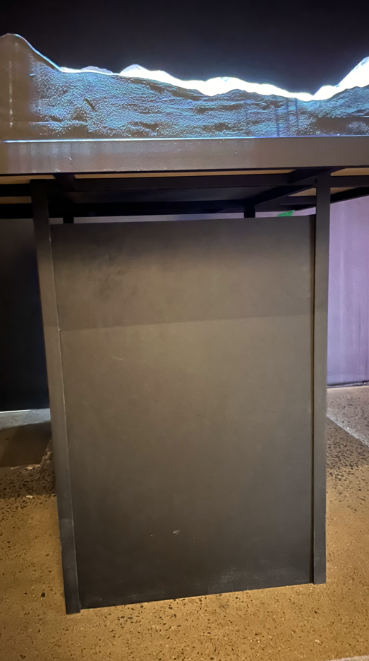

<h1> Oeuvre par Aude Guivarc'h: Écosystème Alpha</h1> 

 

<h2> Age of Union </h2>

Situé à 7049 Rue Saint-Urbain, Montréal jusqu'au 16 mars 2024. 
 
**(Oeuvre temporaire intérieure, lieu fermé définitivement)**

<h5>
  
J'ai visité l'exposition le 2 Mars 2024 </h5>

<h2> "Écosystème Alpha" </h1>

<h2> Aude Guivarc'h </h2>

**Crée le samedi 16 octobre 2021 à la Galerie Never Apart à Montréal, Canada.**
_(Source: https://guivar.ch/Ecosystem-Alpha_v-2-0)_

_(Source de l'image: https://guivar.ch/Ecosystem-Alpha_v-2-0)_ 

<h2>Description</h3>

> L'écosystème Alpha est une sculpture vivante d'un terrain montagneux. Cette installation de mapping vidéo représente une coupe fictive d'un environnement naturel, modélisée par l'artiste. Un « échantillon de la planète Terre » en quelque sorte, formé de reliefs apparemment immobiles, indestructibles, formés au fil des éons. Grâce aux illusions vidéo projetées 
> avec précision sur la surface montagneuse très détaillée, cette sculpture prend vie ; nous voyons les cycles naturels de l'eau, du vent, de l'érosion et des changements de saisons. Le spectateur est plongé dans un paysage pittoresque qui prend vie sous ses yeux.
 **(source: https://guivar.ch/Ecosystem-Alpha_v-2-0)**

Durée de 3 minutes et 30 secondes.

<h2>Installation intéractive </h2>

L'œuvre "Ecosystème-Alpha" crée une expérience interactive qui invite les spectateurs à réfléchir sur leur relation avec l'environnement et l'impact de leurs actions sur la planète.

> Lorsqu'on s'approche trop près, passe la main devant la projection ou pire, touche la surface, le paysage réagit en provoquant un segment de destruction par le feu, annihilant la beauté naturelle de l'environnement. Cette dernière est alors contrainte de recommencer son long et patient travail de création.
> Plus l’installation est perturbée, plus la régénération est longue. Le visiteur est responsable de la destruction de l’œuvre, et affecte ainsi l’expérience des autres visiteurs.
**(source: https://guivar.ch/Ecosystem-Alpha_v-2-0)**

<h2>Mise en espace</h2>

L'œuvre est placée au deuxième étage dans un couloir.

<h2>Élements nécessaires à la mise en exposition + composantes et techniques</h2>

"Écosystème Alpha" d'Aude Guivarc'h est une œuvre multimédia qui combine plusieurs composantes et techniques pour créer une expérience interactive:
 
<ul>
<li> Installation physique, oeuvre imprimé en 3D: </li>

 
<li> Vidéoprojecteur pour projeter les images vidéo sur la surface de la sculpture: </li>

  

<li> Système interactif + Programmation interactive  </li>
Utilisation du kinect.
Nécessaire pour contrôler les réponses de l'installation aux interactions des spectateurs.

<li> Effets sonores interactifs. </li>
VIDEO ICI
</ul>

<h2>Expérience vécue + Commentaire personnel </h2>

add a part to say that the experience is described as immersive but from my experience it wasnt because it was in a corridor between other stuff and wasn't really immersive but only interactive

